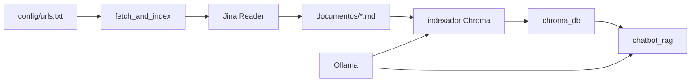

# ai-agents

Scripts en Python para construir un asistente RAG local con **Ollama**, **ChromaDB** y **LangGraph**. Permite descargar documentación web, indexarla como vectores y consultarla en español con contexto recuperado.

## Para qué sirve

Este proyecto automatiza un flujo de trabajo típico en ciberseguridad y documentación técnica:

1. Descargar páginas web como Markdown.
2. Indexarlas en una base vectorial local.
3. Consultarlas mediante un chatbot que recupera contexto relevante antes de responder.

## Qué problema resuelve

Evita copiar y pegar manualmente información de CVEs, advisories o notas técnicas. Centraliza la documentación en ChromaDB y permite hacer preguntas en lenguaje natural con respuestas basadas en el contenido indexado.

## Características principales

- Descarga de URLs a Markdown mediante [Jina Reader](https://jina.ai/reader/).
- Indexación en ChromaDB con embeddings de Ollama.
- Chatbot RAG con grafo LangGraph (nodos `retrieve` + `generate`).
- Chat con memoria de conversación por hilos (`thread_id`).
- Utilidad para inspeccionar colecciones Chroma.
- Script experimental para vaults de Obsidian.

## Estructura del proyecto

```
ai-agents/
├── README.md
├── .env.example
├── requirements.txt
├── config/
│   └── urls.example.txt      # Plantilla de URLs
├── scripts/
│   ├── fetch_and_index.py    # Descarga + indexación
│   ├── index_documents.py    # Solo indexación
│   ├── chatbot_rag.py        # Chat RAG
│   ├── chatbot_memory.py     # Chat con memoria
│   ├── monitor_chroma.py     # Inspección de Chroma
│   └── obsidian_rag.py       # Experimental (Obsidian)
├── examples/
│   └── simple_chat.py        # Ejemplo mínimo sin memoria
├── src/python_agents/        # Configuración y lógica compartida
├── docs/                     # Documentación adicional
├── data/                     # Datos runtime (gitignored)
└── documentos/               # Markdown descargado (gitignored)
```

## Requisitos

- Python 3.11 o superior
- [Ollama](https://ollama.com/) accesible (local o remoto)
- Modelos en Ollama: chat (`gemma4:e2b` por defecto) y embeddings (`mxbai-embed-large` por defecto)
- Conexión a internet para descargar URLs (solo en `fetch_and_index.py`)

## Instalación

```powershell
cd python-agents
python -m venv .venv
.venv\Scripts\activate
pip install -r requirements.txt
copy .env.example .env
```

Edita `.env` con tu configuración real (especialmente `OLLAMA_BASE_URL`).

Para las URLs, copia la plantilla:

```powershell
copy config\urls.example.txt config\urls.txt
```

## Configuración de variables de entorno

| Variable | Descripción | Valor por defecto |
|---|---|---|
| `OLLAMA_BASE_URL` | URL del servidor Ollama | `http://localhost:11434` |
| `OLLAMA_CHAT_MODEL` | Modelo de chat | `gemma4:e2b` |
| `OLLAMA_EMBED_MODEL` | Modelo de embeddings | `mxbai-embed-large` |
| `CHROMA_DIR` | Carpeta de persistencia Chroma | `chroma_db` |
| `CHROMA_COLLECTION` | Nombre de la colección | `web_docs` |
| `DOCUMENTS_DIR` | Carpeta de Markdown | `documentos` |
| `JINA_API_KEY` | Token opcional de Jina Reader | vacío |
| `OBSIDIAN_VAULT_PATH` | Ruta al vault Obsidian (experimental) | vacío |

## Cómo ejecutar los scripts principales

Desde la raíz del proyecto:

```powershell
# 1. Descargar URLs e indexar en Chroma
python scripts/fetch_and_index.py

# 2. Indexar solo los .md existentes en documentos/
python scripts/index_documents.py

# 3. Chat RAG sobre la colección indexada
python scripts/chatbot_rag.py

# 4. Inspeccionar colecciones Chroma
python scripts/monitor_chroma.py
```

Otros scripts:

```powershell
# Chat con memoria por hilos
python scripts/chatbot_memory.py

# Ejemplo mínimo (sin memoria persistente)
python examples/simple_chat.py

# RAG sobre Obsidian (experimental, requiere OBSIDIAN_VAULT_PATH)
python scripts/obsidian_rag.py
```

También puedes pasar URLs directamente:

```powershell
python scripts/fetch_and_index.py https://ejemplo.com/pagina
```

## Ejemplos de uso

### Flujo completo RAG

```powershell
copy .env.example .env
# Editar OLLAMA_BASE_URL en .env

copy config\urls.example.txt config\urls.txt
# Añadir URLs en config/urls.txt

python scripts/fetch_and_index.py
python scripts/chatbot_rag.py
```

En el chat RAG:

- `/exit` — salir
- `/thread mi-hilo` — cambiar hilo de conversación
- `/state` — ver estado del grafo

## Flujo general de funcionamiento



1. **Ingesta:** se descargan URLs y se guardan como `.md` en `documentos/`.
2. **Indexación:** los documentos se dividen en chunks y se almacenan en ChromaDB con embeddings.
3. **Consulta:** el chatbot recupera los chunks más relevantes y genera una respuesta con Ollama.

## Tecnologías usadas

- [LangChain](https://python.langchain.com/) — loaders, splitters, integraciones
- [LangGraph](https://langchain-ai.github.io/langgraph/) — grafos de agentes con memoria
- [ChromaDB](https://www.trychroma.com/) — base de datos vectorial
- [Ollama](https://ollama.com/) — modelos LLM y embeddings locales/remotos
- [Jina Reader](https://jina.ai/reader/) — conversión de URLs a Markdown

## Estado actual del proyecto

**Experimental / en desarrollo activo.**

- El flujo principal (descarga → indexación → chat RAG) está funcional.
- `obsidian_rag.py` y `simple_chat.py` son utilidades secundarias o de ejemplo.
- No hay tests automatizados ni empaquetado como librería instalable.
- La licencia aún no está definida.

## Próximos pasos recomendados

- Añadir una licencia (MIT sugerida).
- Crear tests básicos de smoke para ingest y configuración.
- Unificar las dos rutas de Chroma (`chroma_db/` y `data/chroma/`).
- Añadir CLI con `argparse` o `typer` para los scripts.
- Soporte para reindexación incremental (evitar duplicados).

## Documentación adicional

- [Arquitectura](docs/ARCHITECTURE.md)
- [Guía de uso](docs/USAGE.md)
- [Agentes LangGraph](docs/AGENTS.md)

## Avisos importantes

- **No subas `.env`** ni bases vectoriales al repositorio.
- Los modelos y la URL de Ollama deben existir en tu entorno antes de ejecutar los scripts.
- `scripts/obsidian_rag.py` es experimental y requiere configurar `OBSIDIAN_VAULT_PATH`.
- Sin `JINA_API_KEY`, Jina Reader funciona con límites de uso; consulta su documentación.

## Licencia

Pendiente de definir.
